## cocos3x入门教程

<https://forum.cocos.org/t/topic/122399>

## 创建部分略过

### 创建场景

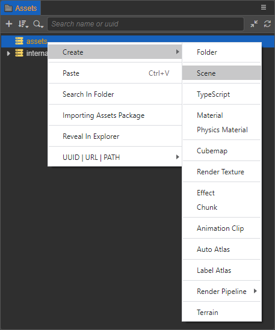

### 创建物体

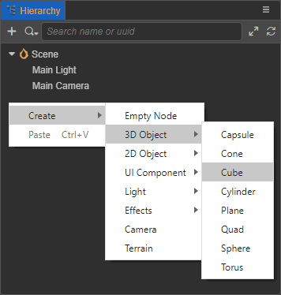

### 新建脚本

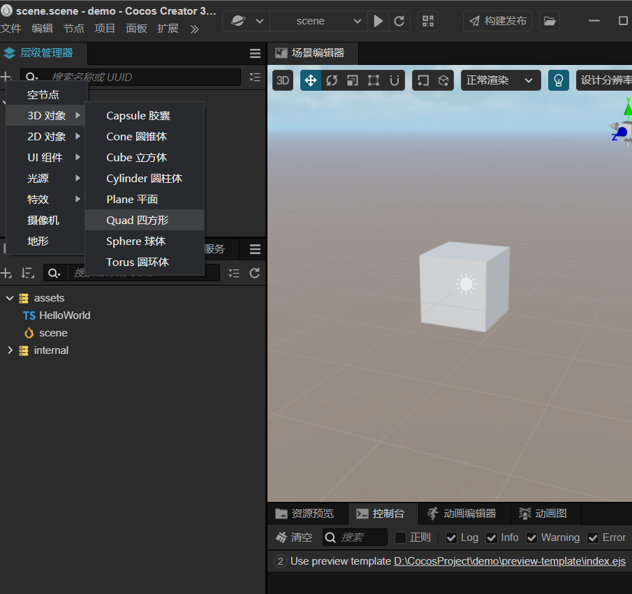

- 激活脚本
 在脚本中添加 start() 函数，start() 函数会在组件第一次激活时调用
 双击即可打开脚本在你喜欢的编辑器，当然前提你得设置，或者你只有一个编辑器，就像我一样

### 绑定脚本

在 层级管理器 中选中创建的 Cube 节点，然后在 属性检查器 面板最下方点击 添加组件 -> 自定义脚本 ->
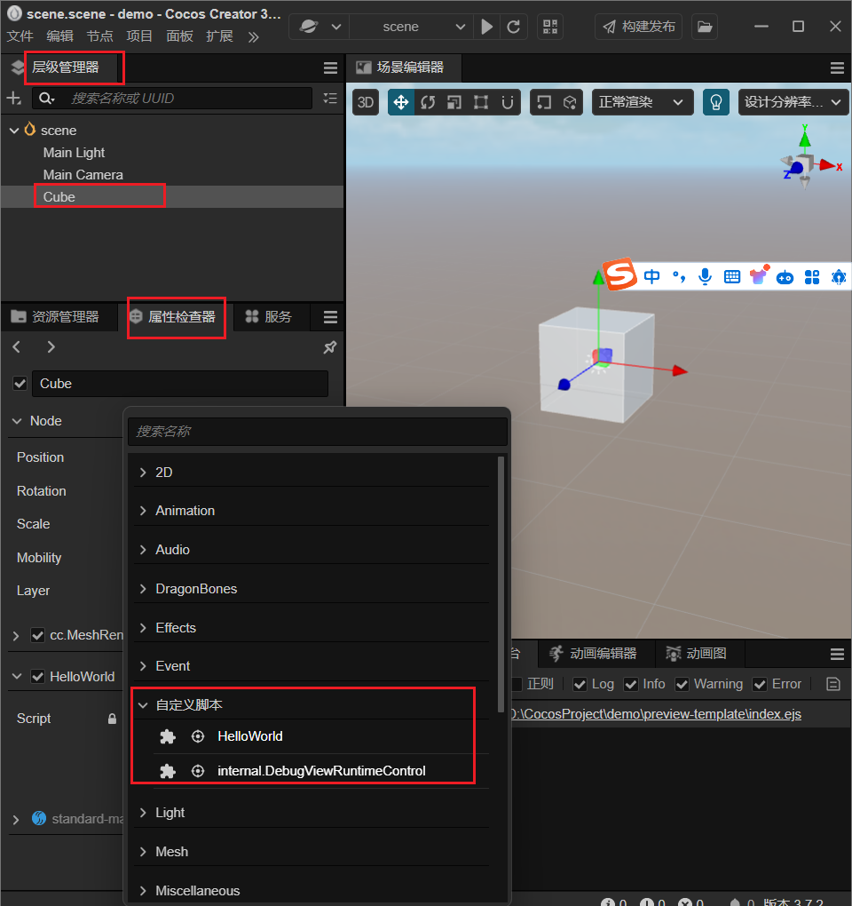

### 预览场景

选中对应的场景点启动
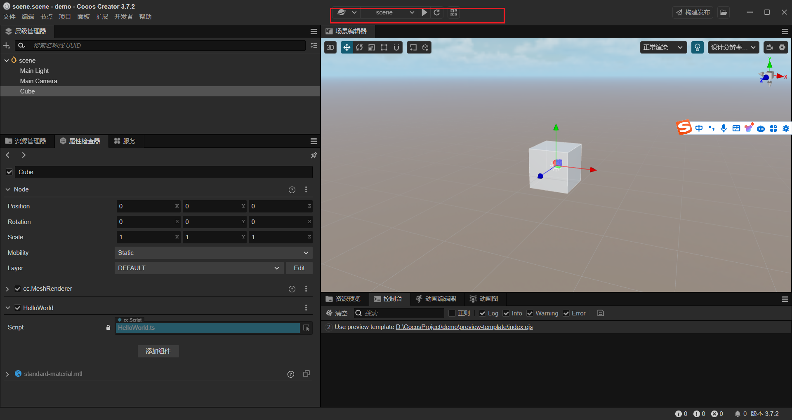

- 最终会在控制台输入激活后的副作用
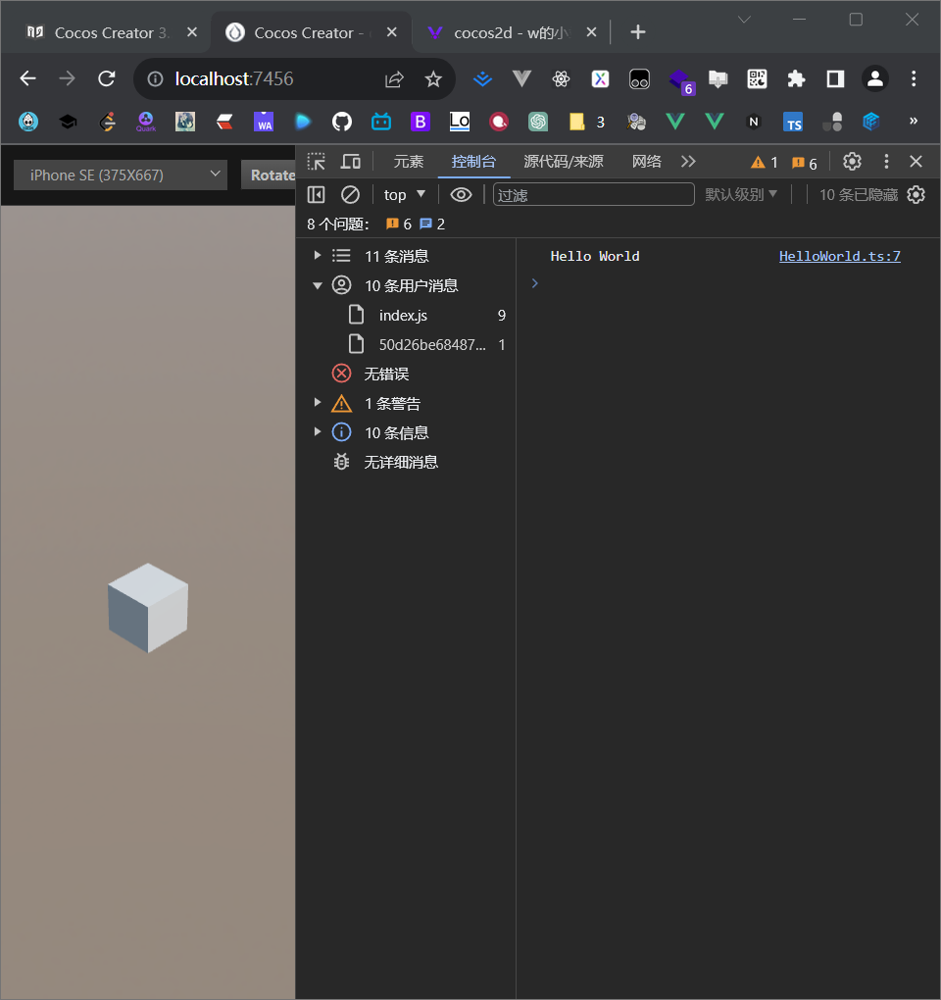

## 修改场景中的 Camera

在预览中我们可以看到立方体似乎有点太小了，通过调整场景中的 Camera 来调整场景运行时显示的区域，

- Camera 代表的是游戏中的玩家视角。

选中一个camera,这里选中main

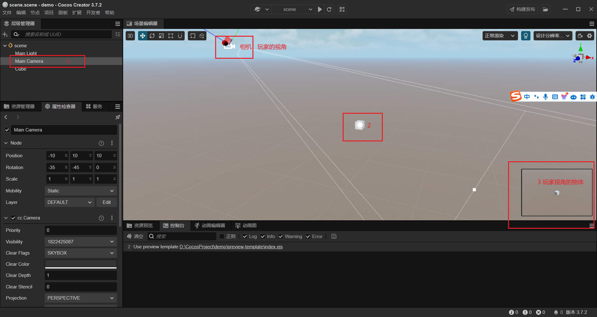

### 拖动相机

拖动相机呢，相当于我们玩家玩游戏时候的转动的第一视角，就像这样

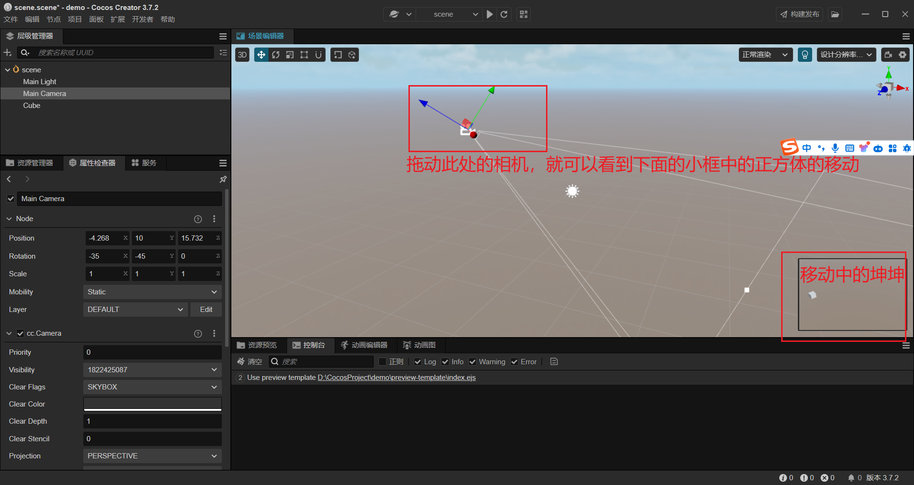

### 放大物体

此处需要你稍微具有点初中物理的知识，

- 远小近大

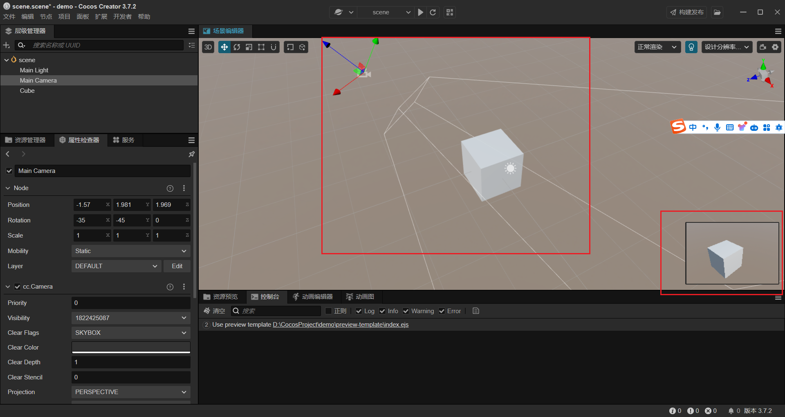
所以 我们想要把物体放大一点，就需要让这个cube更靠近这个视角的顶点

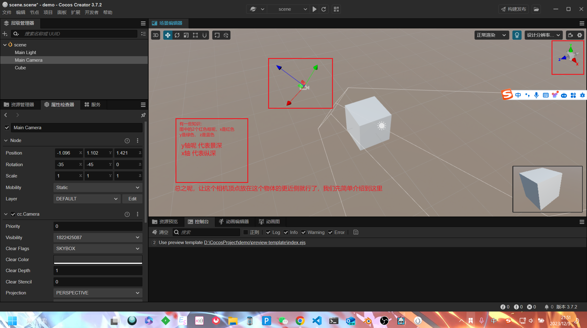
记住和右上角的相同颜色的轴，单击选中同颜色的轴就可以改变当前轴的深度了
比如把蓝色往上 就相当于 z轴更高，这样视角就离物体比较远了

`点选对应颜色的轴，拖动即可快速调整视角的位置`

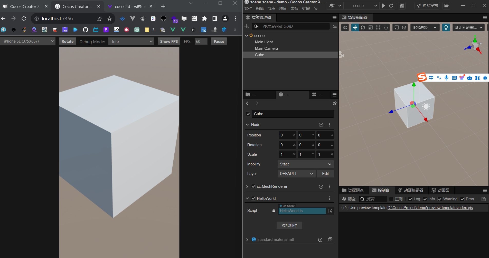
现在就变得很大了，记得ctrl+s保存哦,会自动更新的，就像hmr一样
