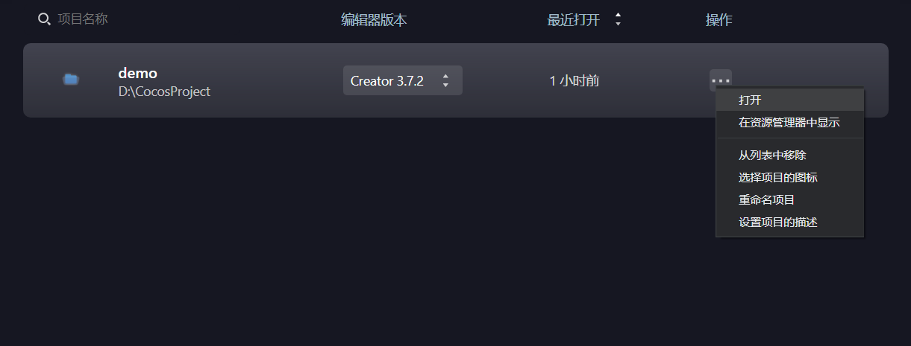
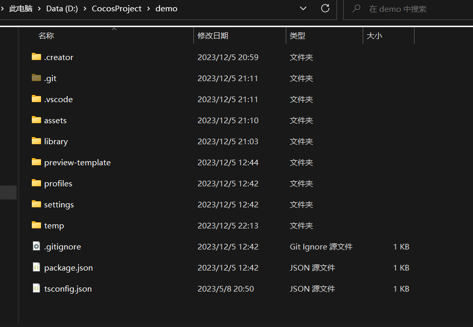
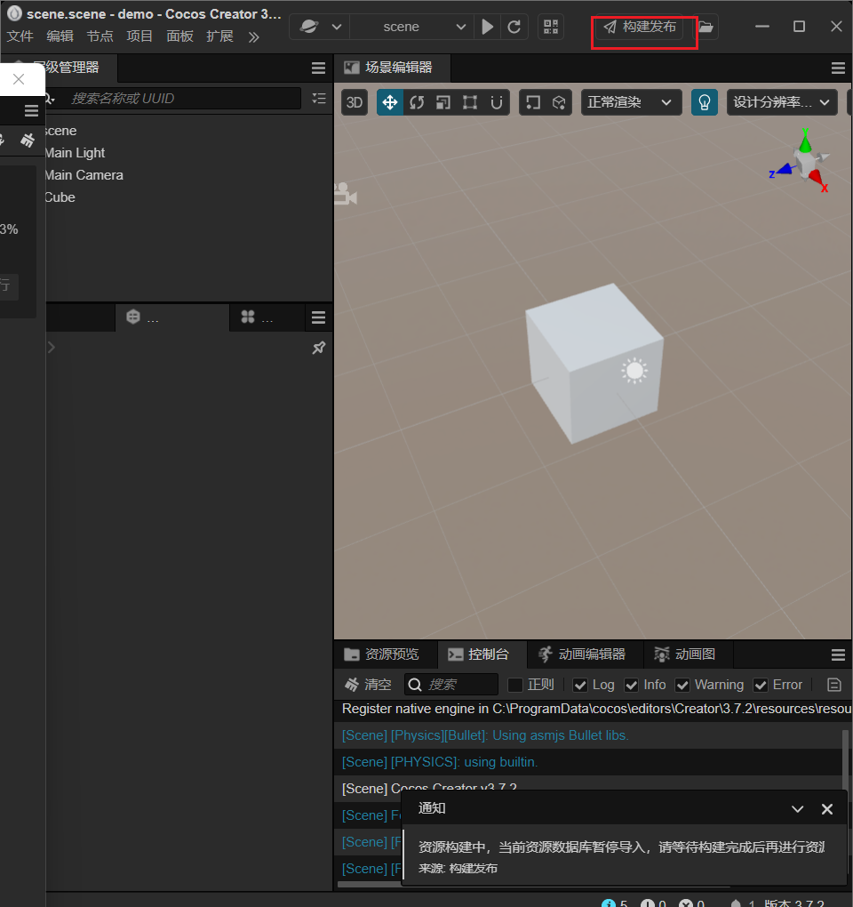
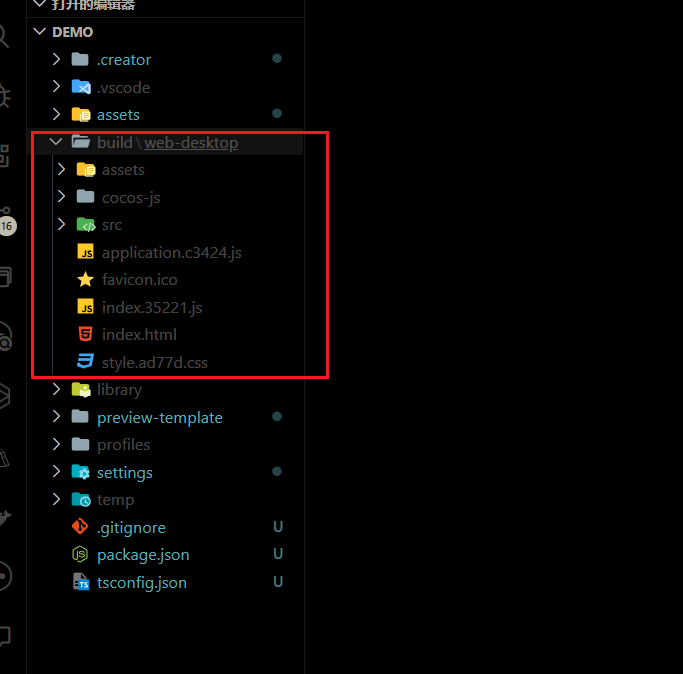

在资源管理器中显示

## 目录结构

### .creator

  是一些模板，后面再说

### .git

  这个不知道的话，建议百度 【做程序的应该没有不知道的】

### .vscode 主要是一些vsc的配置文件

### assets：资源目录

    本地资源、脚本和第三方库文件
    只有在 assets 目录下的内容才能显示在 资源管理器 中。
    .meta 可以理解为sourcemap的作用，用来存储资源配置对应的索引
    .meta 文件需要一并提交到版本控制系统
    .psd文件可以放在assets外部

### build：构建目录（在构建某平台后会生成该目录）

    项目 -> 构建发布
    之后会创建一个build目录用来存放构建的工程
    类似于dist

点击构建后，可选发布平台

构建后的web产物

### library：导入的资源目录

    是assets导入后生成的，在这里文件的结构会处理成游戏最终发布的格式
    丢失或损坏时，删除library，然后再重新打开即可

### local：日志文件目录

### profiles：编辑器配置

### temp：临时文件目录

### package.json：项目配置
