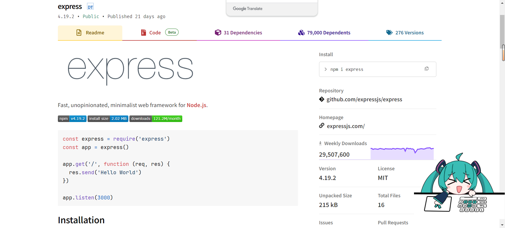
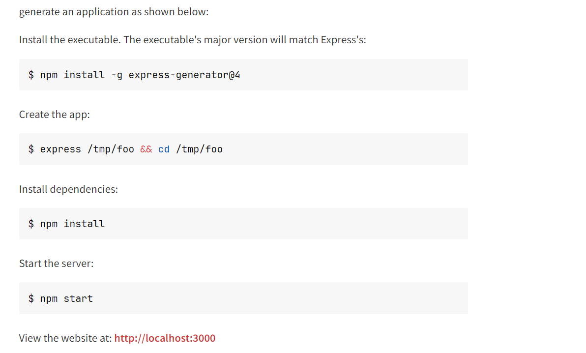

express呢是一个npm包啦，要使用它也很简单只需要一行shell

```bash
pnpm i express
```
然后打开浏览器 搜索 express npm


```bash
const express = require('express')
const app = express()

app.get('/', function (req, res) {
  res.send('Hello World')
})

app.listen(3000)
```
使用起来也很简单，它是cjs的模块哈，引入这个包 然后调用了express的函数 然后有暴露get、post之类的方法，第一个入参一个路由，第二个入参接受一个callback function，然后调用了send方法，实际上和koa2一样 应该都是调用的http.createServer()这个方法，node下面的模块

不过更推荐安装
```bash
npm install -g express-generator@4
```
懒得写了直接看图吧


然后访问https://localhost:3000 看到字符串就成功了
