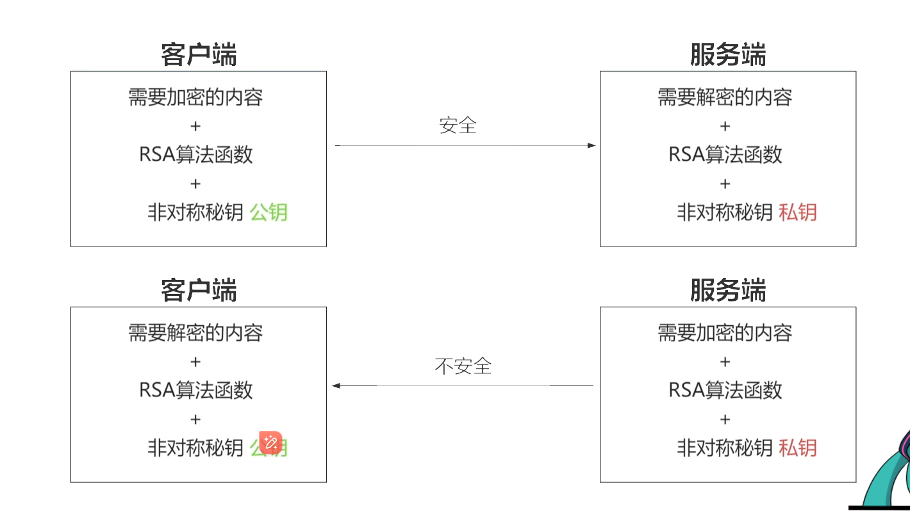

关于加密的相关此处不展开，可以通过中间人，sql注入这些攻击，但是我们只需要发送到server是加密的就行 所以 需要用到2个npm库

前端
```bash
pnpm i  jsencrypt
```

后端

```bash
pnpm i node-jsencrypt
```

### 前端公钥加密，用常用的rsa加密算法，rsa网上一堆生成网站

```ts
import Crypt from 'jsencrypt'
import { PublicKey } from '../common';

const crypt = new Crypt()
crypt.setKey(PublicKey)

  const account = crypt.encrypt(this.account.string);
  const password = crypt.encrypt(this.password.string);
```
整体代码如下
```ts
import { _decorator, Component, EditBox, Node } from 'cc';
const { ccclass, property } = _decorator;
import Crypt from 'jsencrypt'
import { PublicKey } from '../common';

const crypt = new Crypt()
crypt.setKey(PublicKey)

@ccclass('LoginManger')
export class LoginManger extends Component {
    account: EditBox
    password: EditBox

    /**
     * Method called when the component is loaded.
     */
    onLoad() {
        this.account = this.node.getChildByName('Account').getComponent(EditBox);
        this.password = this.node.getChildByName('Password').getComponent(EditBox);
    }

    /**
     * A description of the entire function.
     *
     * @param {type} paramName - description of parameter
     * @return {type} description of return value
     */
    async register() {
        const account = crypt.encrypt(this.account.string);
        const password = crypt.encrypt(this.password.string);

        console.log('account :>> ', account);
        console.log('password :>> ', password);

        const res = await fetch("http://localhost:3000/register", {
            method: "POST",
            headers: {
                "Content-Type": "application/json",
            },
            body: JSON.stringify({ account, password }),
        })
            .then((response) => response.json())
        console.log('res :>> ', res);
    }
}

```

### 后端 同样引入解密的包，然后用私钥去解密码

```ts
// @ts-ignore
import Crypt from 'node-jsencrypt'

import { PrivateKey } from '../common'

const crypt = new Crypt()
crypt.setKey(PrivateKey)

let { account, password } = req.body
  account = crypt.decrypt(account)
  password = crypt.decrypt(password)
```

整体代码如下
```ts
import express from 'express'
import cors from 'cors'
import bodyParser from 'body-parser'
// @ts-ignore
import Crypt from 'node-jsencrypt'

import { PrivateKey } from '../common'

const crypt = new Crypt()
crypt.setKey(PrivateKey)

const app = express()
const port = 3000

app.use(cors())
app.use(bodyParser.json())


app.get('/', (req, res) => {
  res.send('Hello World!')
})

app.post('/register', (req, res) => {
  console.log('req :>> ', req.body);
  let { account, password } = req.body
  account = crypt.decrypt(account)
  password = crypt.decrypt(password)

  res.json({
    code: 200,
    account,
    password,
  })
  console.log('account :>> ', account); ``
  console.log('password :>> ', password);
})

app.listen(port, () => console.log(`Example app listening on port https://localhost:${port}`))

console.log("auth 服务");
```

### 问题

加密完成后，输入密码可以在控制台看到 已经是看不到明文的密码了，但是数据肯定是要把玩家信息保存起来 才能登录另一个玩家，毕竟是mmoact，可以用mysql，下一篇文章学习下
