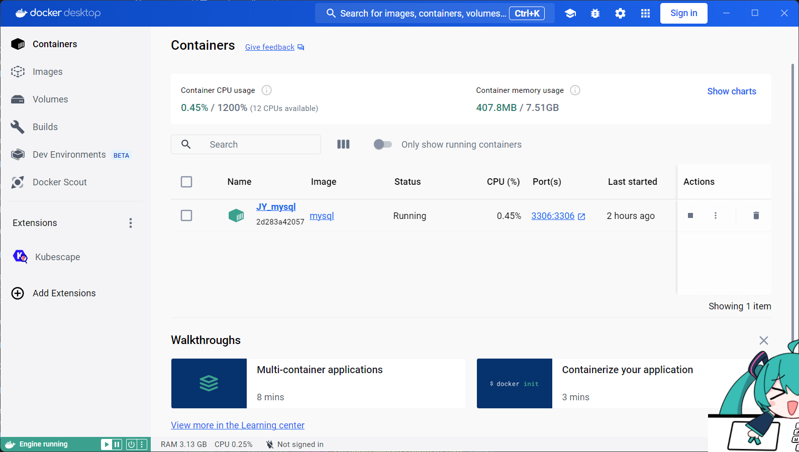
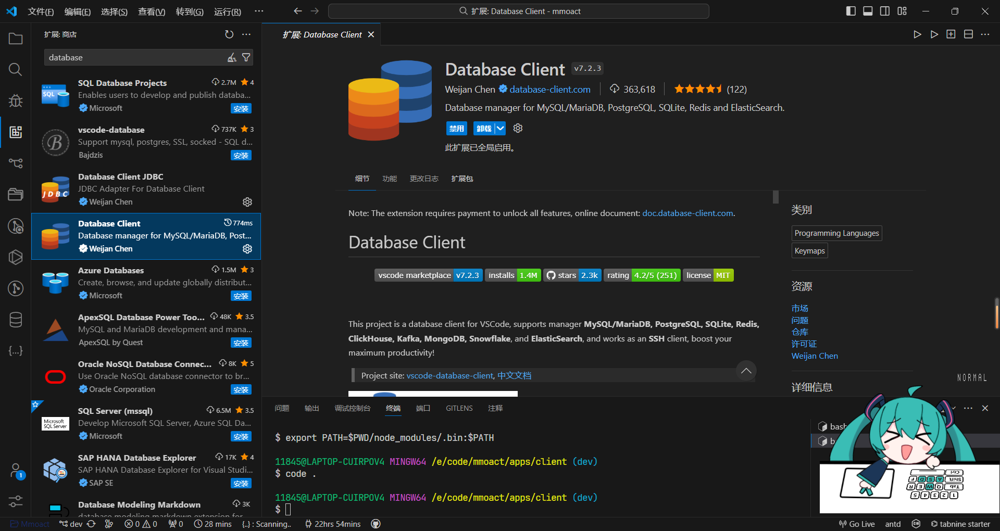
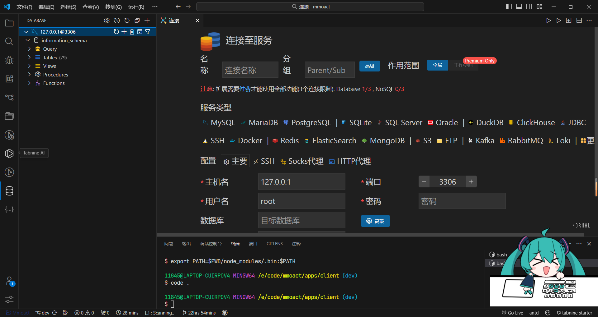
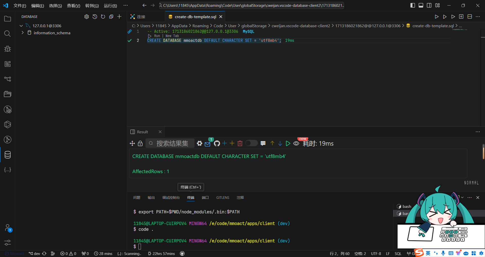
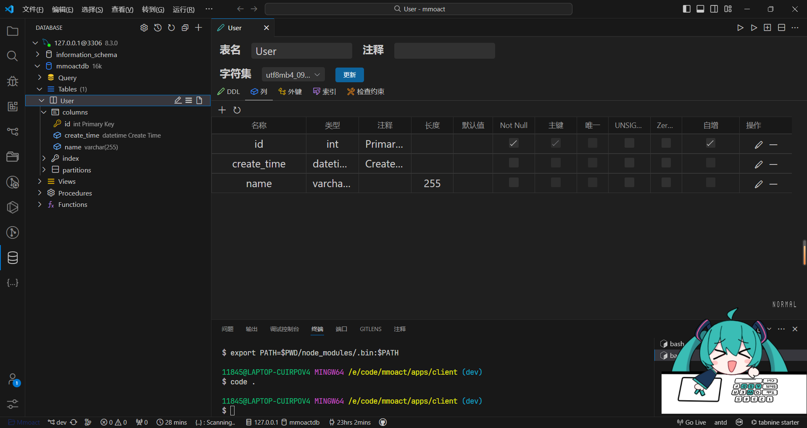
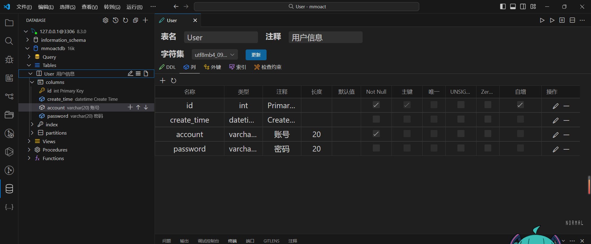
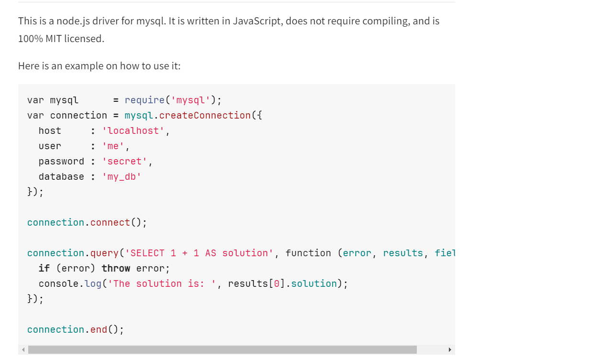
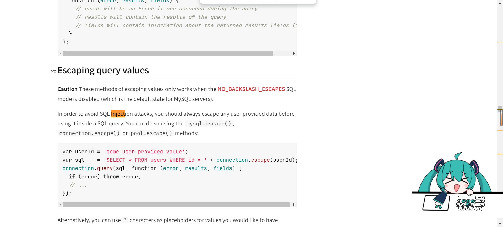
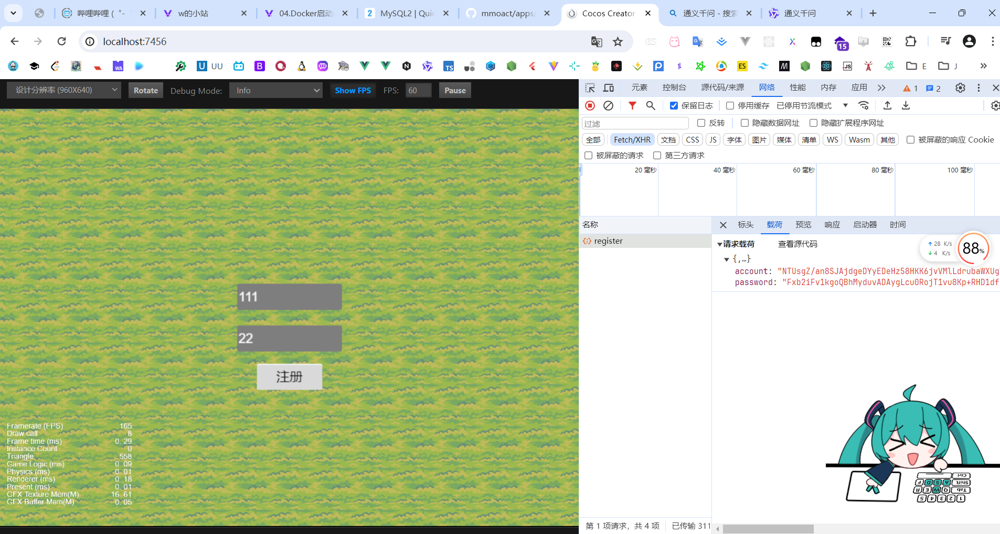
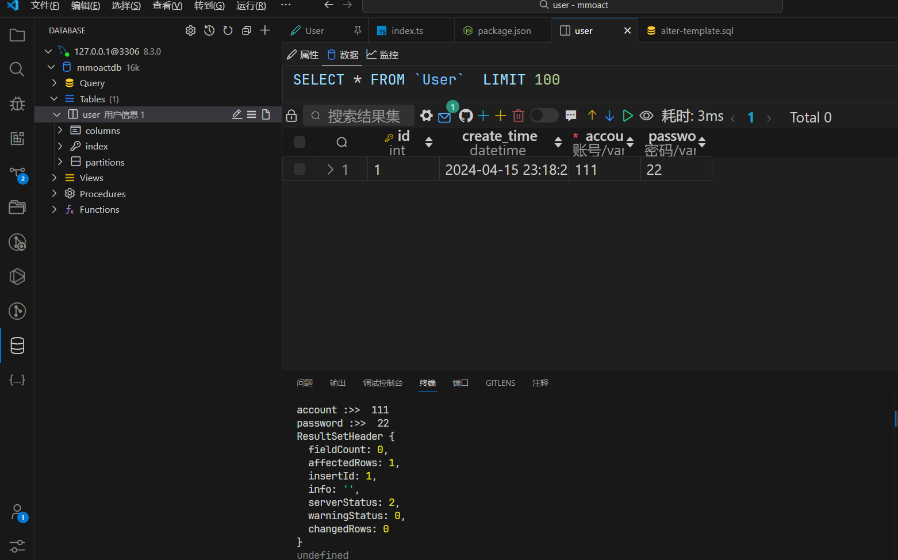

mysql呢，安装起来麻烦，所以就需要docker，我推荐docker desktop，安装省略

### 1. 在docker仓库中搜索mysql的镜像：
```bash
 docker search mysql
```
下载镜像：
```bash
docker pull mysql
```

### 2. 查看本地镜像：
```bash
 docker images -a
```
     a.  参数-a 表示所有

     b. 启动 mysql 容器，并进入 shell 命令交互界面： docker run -it mysql /bin/bash

  (  参数 -i -t 等价于 -it  表示insert , 进入 ;  /bin/bash 表示 shell 脚本交互界面 )

     c. 可用 mysql --help | grep Distrib 查看 mysql 版本信息

 （ mysql --help 查看帮助信息，并在结果集中 查找 Distrib ， “|”单竖线表示命令的连续执行，同时以前一个命令值域作为后一个命令的定义域 ）

### 3. 退出 当前交互窗口：exit 。此操作会关闭 mysql 服务 。

（对于创建的bush 容器，exit 退出后，容器也会退出。

   这是因为对Docker 来说，容器中的应用退出了，容器也就没有必要继续运行了。）

—— 想要服务一直运行可以：

```bash
 docker run -p 3306:3306 --name JY_mysql -e MYSQL_ROOT_PASSWORD=123456 -d mysql
```
（参数 -p 设置端口，--name 取名 ，-e MYSQL_ROOT_PASSWORD=123456 设置 账号为 root ，密码为 123456 ，-d 表示作为一个守护进程在后台运行 ）

### 4. 查看运行中的容器：
```bash
docker ps
```
（可加参数 -a 表示所有，如果不加这个参数只会展示运行状态的容器，

  按容器即服务的思想，某种程度上可以把容器也当作服务，）


这样 mysql 就已安装并成功启动，处于运行状态了。

可以通过 docker port 容器name 查看对应端口：

### 5. 至于相关文件地址配置 ，可以在运行容器时设置 ：

```bash
docker run -p 3306:3306 --name mysql -v $PWD/conf/my.cnf:/etc/mysql/my.cnf -v $PWD/logs:/logs -v $PWD/data:/mysql_data -e MYSQL_ROOT_PASSWORD=123456 -d mysql
```
但要求对应路径对应文件已存在，才能成功挂载相内容到对应位置。

命令说明：
 -p 3306:3306：将容器的3306端口映射到主机的3306端口
 -v $PWD/conf/my.cnf:/etc/mysql/my.cnf：将主机当前目录下的conf/my.cnf挂载到容器的/etc/mysql/my.cnf
 -v $PWD/logs:/logs：将主机当前目录下的logs目录挂载到容器的/logs
 -v $PWD/data:/mysql_data：将主机当前目录下的data目录挂载到容器的/mysql_data
 -e MYSQL_ROOT_PASSWORD=123456：初始化root用户的密码

docker启动好这样就是启动了


## 连接

安装这个插件

然后点左侧的倒数第二个图标，创建一个链接


3306新建一个数据库


### 表
存储密码和账号，需要一个user表


### accout和password字段
新建2个字段 varchar就行 然后20个字符长度


### 连接数据库

```bash
pnpm install mysql
```
安装之后它的npm主页也有使用方法

直接复制这里面的代码，把表名字和密码账号改一下就行

### 执行sql语句
直接写sql语句会有sql注入风险，通常都是通过？？？占位符处理



## mysql2
之前那个包会报错一个
Client does not support authentication protocol requested by server; consider upgrading MySQL client
所以使用新包试试
https://sidorares.github.io/node-mysql2/docs#first-query

```ts
import mysql from 'mysql2';

  const connection = mysql.createConnection({
    host: 'localhost',
    user: 'root',
    password: '123456',
    database: 'mmoactdb',
  });

  // 注册中
  connection.execute(
    'INSERT INTO user (account, password, create_time) VALUES (?, ?, ?)',
    [account, password, dayjs().format('YYYY-MM-DD HH:mm:ss')],
    function (err, results, fields) {
      if (err) {
        console.log('err :>> ', err)
        return
      }
      console.log(results)
      console.log(fields)
    }
  );
```

ts-node不知道为什么在esm下面会报错 所以不得不使用cjs的格式

### 启动游戏
注册账号

表里面已经有数据了

但是明文存储账号密码在数据库里面不太好，所以还需要把密码账号用哈希散列算法混淆一下，这样即使用户数据被盗 还是有一层保障
