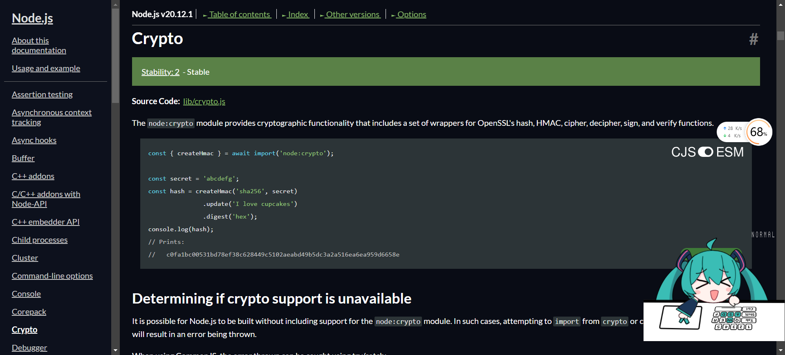
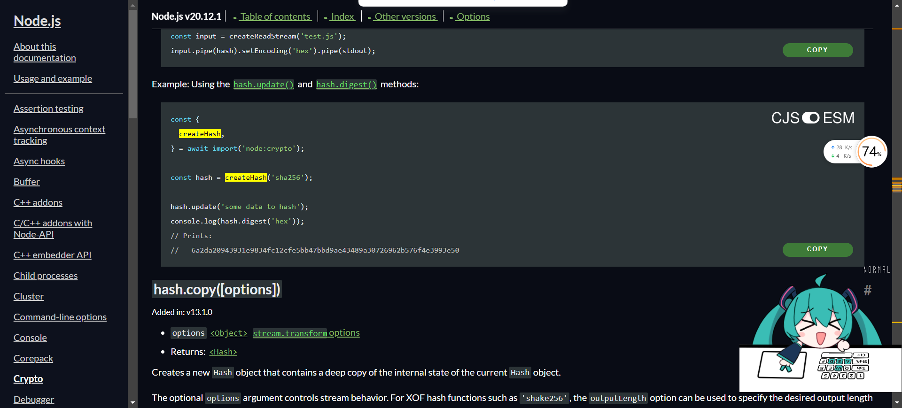
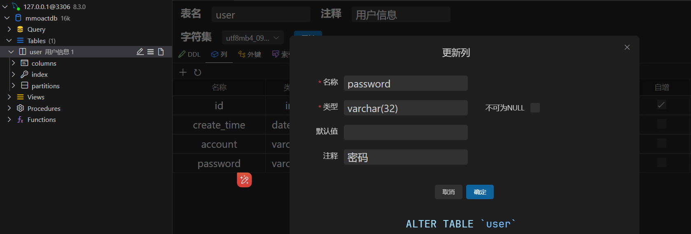
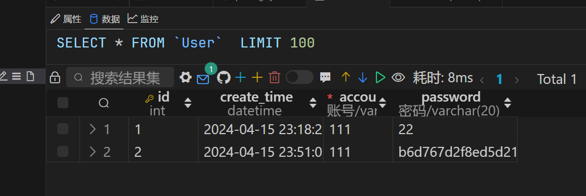

## crypto


## createHash

createHash方法调用的时候使用md5，然后update和digest

```ts
import express from 'express'
import { createHash } from 'crypto';
import cors from 'cors'
import mysql from 'mysql2';
import dayjs from 'dayjs';
import bodyParser from 'body-parser'
// @ts-ignore
import Crypt from 'node-jsencrypt'

import { PrivateKey } from '../common'

const connection = mysql.createConnection({
  host: 'localhost',
  user: 'root',
  password: '123456',
  database: 'mmoactdb',
});

const crypt = new Crypt()
crypt.setKey(PrivateKey)

const app = express()
const port = 3000

app.use(cors())
app.use(bodyParser.json())


app.get('/', (req, res) => {
  res.send('Hello World!')
})

app.post('/register', (req, res) => {
  console.log('req :>> ', req.body)
  let { account, password } = req.body
  account = crypt.decrypt(account)
  password = crypt.decrypt(password)

  const hash = createHash('md5');
  const passwordHash = hash.update(password).digest('hex');

  connection.execute(
    'INSERT INTO user (account, password, create_time) VALUES (?, ?, ?)',
    [account, passwordHash, dayjs().format('YYYY-MM-DD HH:mm:ss')],
    function (err, results, fields) {
      if (err) {
        console.log('err :>> ', err)
        return
      }
      console.log(results)
      console.log(fields)
    }
  );

  res.json({
    code: 200,
    account,
    password,
  })
  console.log('account :>> ', account)
  console.log('password :>> ', password)
})

app.listen(port, () => console.log(`Example app listening on port https://localhost:${port}`))

console.log("auth 服务")
```

## 密码需要更新成32位的

