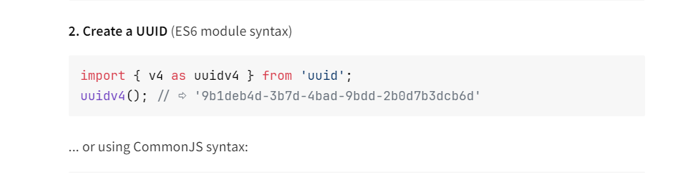

### uuid

```bash
pnpm install uuid
```

### token


### login
登录和注册一样，从表里面查对应account和password就行了

```ts
const cache = new Map()

app.post('/login', (req, res) => {
  console.log('req :>> ', req.body)
  let { account, password } = req.body
  account = crypt.decrypt(account)
  password = crypt.decrypt(password)

  const hash = createHash('md5');
  const passwordHash = hash.update(password).digest('hex');

  connection.execute(
    'SELECT * FROM user WHERE account = ? AND password = ?',
    [account, passwordHash],
    (err, results: any[], fields): void => {
      if (err) {
        console.log('err :>> ', err);
        return;
      }
      if (results.length > 0) {
        const token = uuidv4()
        cache.set(token, account),
          res.json({
            code: 200,
            message: '登录成功',
            token
          })
        console.log('cache :>> ', cache);
      } else {
        res.json({
          code: 400,
          message: '登录失败,账号不存在或密码错误'
        })
      }
    }
  );
})
```
