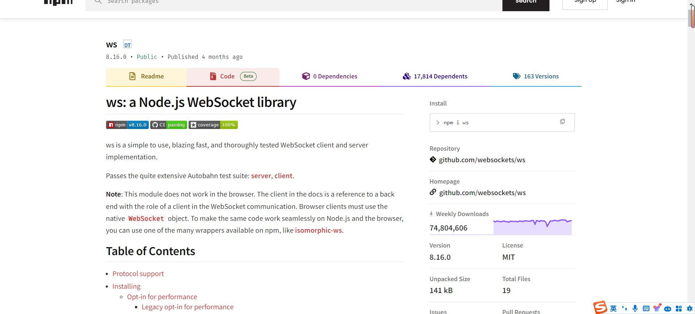
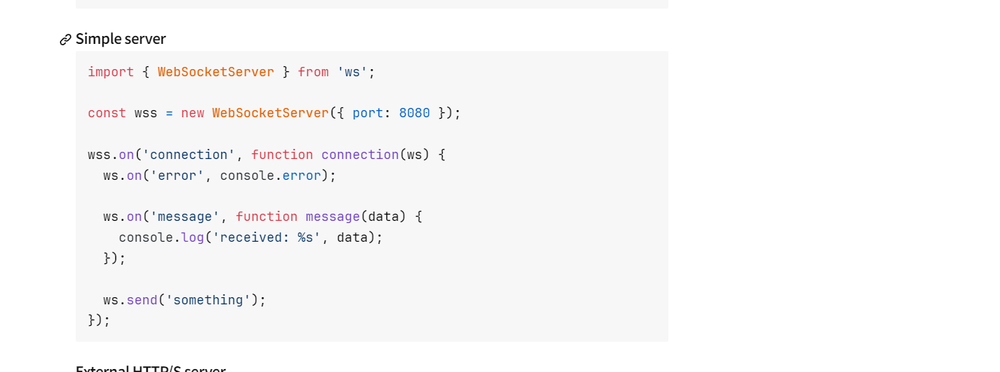
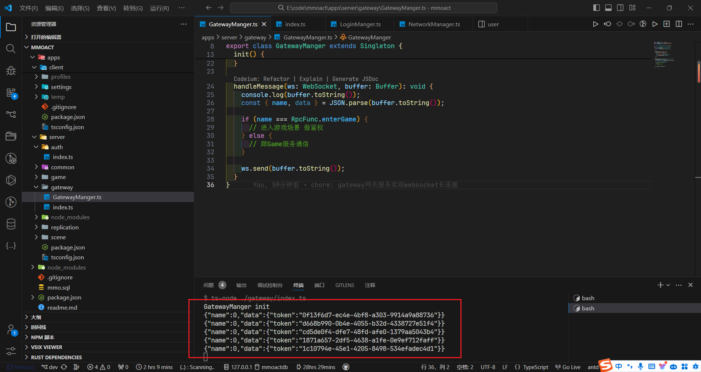

### gateway

gateway 网关服务，为什么需要做呢？

- 首先，游戏登录界面可能需要多个和游戏服务器通信，而这些服务肯呢个位于不同的地理位置，网关服务可以将所有游戏服务器通信路由到同一个地址
- 游戏服务器可能需要跨区域的通信
  - 因为默认游戏上线后是全国玩家都可以玩
- 另外mmoact游戏服务需要处理大量玩家的链接来保持请求可以  分流和负载均衡

### login
在登录后呢，我们需要鉴权以及一系列操作，并且一直保持登录状态，然后我们要登录另一个玩家，所以需要长链接。
- http 无状态
- webscoket

了解到websocket可以做到长链接，这和我们的需要一拍即合，在npm找一下


## (元神)，startup


## server
新建一个gatewayManger主要用来做网关服务, 引入基础类和websocket的服务

```ts
import { WebSocketServer, WebSocket } from 'ws';
import { RpcFunc } from '../common';
import { Singleton } from '../common/common/base';

const wss = new WebSocketServer({ port: 4000 });

export class GatewayManger extends Singleton {
  static get Instance() {
    return super.GetInstance<GatewayManger>();
  }

  init() {
    console.log('GatewayManger init');
    wss.on('connection', (ws) => {
      ws.on('error', console.error);

      ws.on('message', (buffer: Buffer) => {
        this.handleMessage(ws, buffer);
      });
    });
  }

  // 处理接受到的消息
  handleMessage(ws: WebSocket, buffer: Buffer): void {
    console.log(buffer.toString());
    const { name, data } = JSON.parse(buffer.toString());

    if (name === RpcFunc.enterGame) {
      // TODO 进入游戏场景 做鉴权
    } else {
      // TODO 跟Game服务通信
    }
    ws.send(buffer.toString());
  }
}
```

并在入口文件init一下

```ts
import { GatewayManger } from './GatewayManger';

GatewayManger.Instance.init()
```

至此后端的长连接就搞定了，然后新开一个bash, yarn gateway启动一下gateway服务

## client

前端呢需要首先在登录之后做调用长链接

```ts
  async login() {
    const account = crypt.encrypt(this.account.string);
    const password = crypt.encrypt(this.password.string);

    console.log('account :>> ', account);
    console.log('password :>> ', password);

    const res = await fetch("http://localhost:3000/login", {
        method: "POST",
        headers: {
            "Content-Type": "application/json",
        },
        body: JSON.stringify({ account, password }),
    })
        .then((response) => response.json())
    console.log('res :>> ', res);

    this.connect(res.token);
  }

  // ws的长连接
  async connect() {
    await NetworkManager.Instance.connect()
    const res = await NetworkManager.Instance.call(RpcFunc.enterGame, { token });
    console.log('connect :>> ', res);
  }

  // NetworkManager.ts
  import { Singleton } from "../common/base";
  import { getProtoPathByRpcFunc, RpcFunc, ProtoPathEnum, ServerPort } from "../common";
  // @ts-ignore
  import protoRoot from "../proto/index.js";

  const TIMEOUT = 5000;

  interface IItem {
    cb: Function;
    ctx: unknown;
  }

  export type IData = Record<string, any>;

  export default class NetworkManager extends Singleton {
    static get Instance() {
      return super.GetInstance<NetworkManager>();
    }

    ws: WebSocket;
    port = ServerPort.Gateway;
    maps: Map<RpcFunc, Array<IItem>> = new Map();
    isConnected = false;

    connect() {
      return new Promise((resolve, reject) => {
        if (this.isConnected) {
          resolve(true);
          return;
        }
        this.ws = new WebSocket(`ws://localhost:${this.port}`);
        //onmessage接受的数据类型，只有在后端返回字节数组的时候才有效果
        this.ws.binaryType = "arraybuffer";

        this.ws.onopen = () => {
          this.isConnected = true;
          resolve(true);
        };

        this.ws.onerror = (e) => {
          this.isConnected = false;
          console.log(e);
          reject("ws error");
        };

        this.ws.onclose = () => {
          this.isConnected = false;
          console.log("ws onclose");
          reject("ws close");
        };

        this.ws.onmessage = (e) => {
          try {
            const { data, name } = JSON.parse(e.data);
            try {
              if (this.maps.has(name) && this.maps.get(name).length) {
                this.maps.get(name).forEach(({ cb, ctx }) => cb.call(ctx, data));
              } else {
                console.log(`no ${name} message or callback, maybe timeout`);
              }
            } catch (error) {
              console.log("call error:", error);
            }
          } catch (error) {
            console.log("onmessage parse error:", error);
          }
        };
      });
    }

    call(name: RpcFunc, data: IData) {
      return new Promise<{ data?: any; error?: string }>((resolve) => {
        try {
          // 超时处理
          const timer = setTimeout(() => {
            resolve({ error: "Time Out!" });
            this.unListen(name, cb, null);
          }, TIMEOUT);

          // 回调处理
          const cb = (res) => {
            resolve(res);
            clearTimeout(timer);
            this.unListen(name, cb, null);
          };

          // 监听响应事件触发回调
          this.listen(name, cb, null);

          // 发送消息
          this.send(name, data);
        } catch (error) {
          resolve({ error });
        }
      });
    }

    async send(name: RpcFunc, data: IData) {
      const obj = {
        name,
        data
      }
      this.ws.send(JSON.stringify(obj)); // 需要发送一个字符串
    }

    listen(name: RpcFunc, cb: (args: any) => void, ctx: unknown) {
      if (this.maps.has(name)) {
        this.maps.get(name).push({ ctx, cb });
      } else {
        this.maps.set(name, [{ ctx, cb }]);
      }
    }

    unListen(name: RpcFunc, cb: (args: any) => void, ctx: unknown) {
      if (this.maps.has(name)) {
        const items = this.maps.get(name);
        const index = items.findIndex((i) => cb === i.cb && i.ctx === ctx);
        index > -1 && items.splice(index, 1);
      }
    }
  }

```

## login



这样到底为止，gateway服务的长连接就建立好了，接下来还要实现服务之间的调用，之后学习一下
