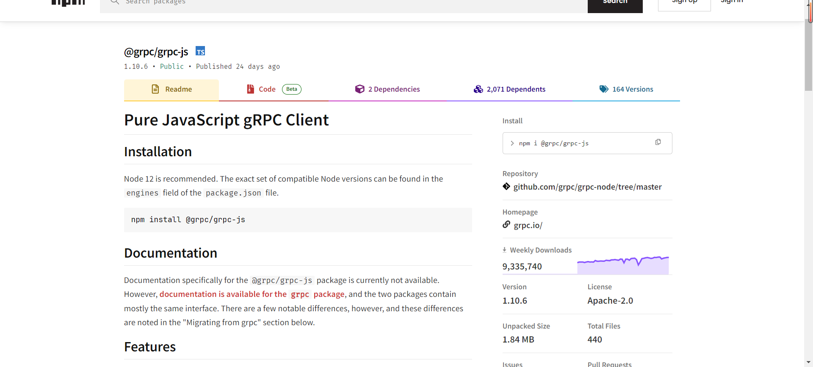
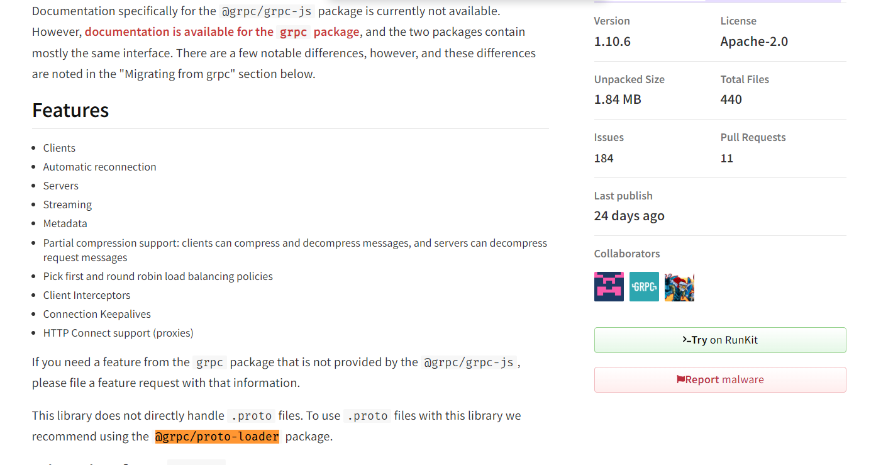
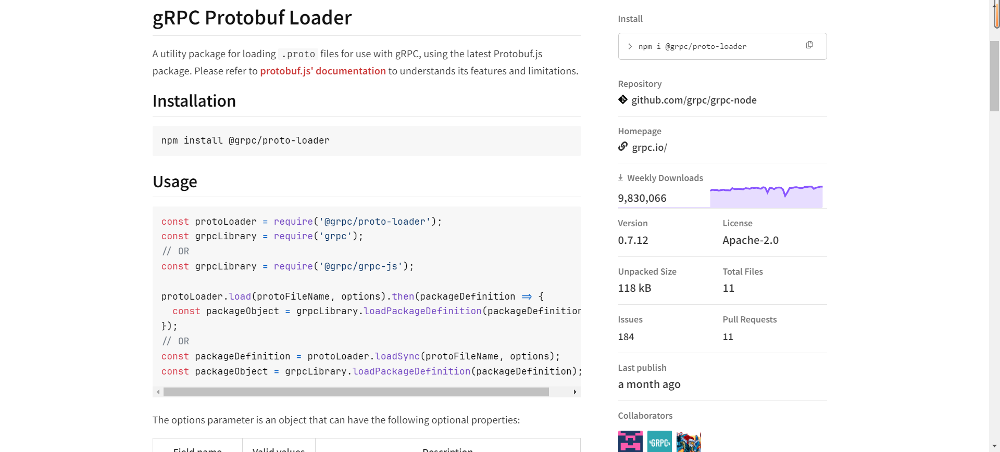
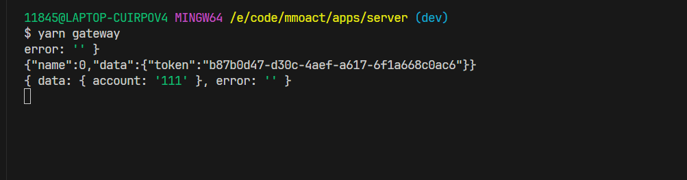
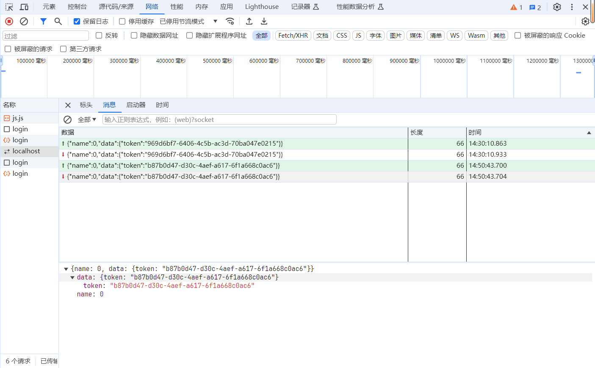

## 为什么需要rpc以及rpc是什么？
我就不班门弄斧了，直接看大佬的文章吧
[怎么理解rpc，既然有http请求了为啥还要用rpc？](https://www.zhihu.com/question/524580708/answer/2584782720)

## grpc
谷歌的高性能基于http2的rpc框架，使用它
[grpc](https://grpc.io/docs/languages/node/quickstart/)

简单来说 按照我的理解现在都是微服务架构和部署，这样服务之间的通信用rpc能做的事情就比较方便一点。

### @grpc/grpc-js
和往常一样，直接去npm找google的官网

另外不会默认处理proto文件

### @grpc/proto-loader



## .proto

```proto
syntax = "proto3";

package auth;

service Auth {
  rpc checkToken(CheckTokenReq) returns (CheckTokenRes) {}
}

message CheckTokenReq {
  string token = 1;
}

message CheckTokenRes {
  CheckTokenResData data = 1;
  optional string error = 2;
}

message CheckTokenResData {
  string account = 2;
}

```
## 开拔

auth里面需要加一个authService

```ts
import * as grpc from '@grpc/grpc-js';

const cache = new Map()
const server = new grpc.Server()

// Server.addService(service: grpc.ServiceDefinition<grpc.UntypedServiceImplementation>, implementation: grpc.UntypedServiceImplementation): void
server.addService(AuthService, {
  checkToken(call, callback) {
    const token = call.request.getToken()
    const data = new CheckTokenRes()

    if (cache.has(token)) {
      const data = new CheckTokenResData()
      data.setAccount(cache.get(token))
      res.setData(data)
    } else {
      res.setError('token is not exist')
    }
    callback(null, res)
  }
})

server.bindAsync('localhost:3333', grpc.ServerCredentials.createInsecure(), () => {
  server.start()
  console.log('authのrpc 服务启动成功')
})
```

同时gateway里面也需要改造

```ts
  handleMessage(ws: WebSocket, buffer: Buffer): void {
    console.log(buffer.toString());
    const { name, data } = JSON.parse(buffer.toString());

    if (name === RpcFunc.enterGame) {
      // 进入游戏场景 做鉴权
      this.checkTocken(data)
    } else {
      // 跟Game服务通信
    }

    ws.send(buffer.toString());
  }

  checkTocken({ token }: { token: string }) {
    const client = new AuthClient('localhost:3333', grpc.credentials.createInsecure());

    const req = new CheckTokenReq()
    req.setToken(token);

    client.checkToken(req, (err, message) => {
      console.log(message.toObject())
    })
  }
```


## 问题

现在登陆后发现都是用json传输数据的，需要压缩一下，下一篇文章学习下
