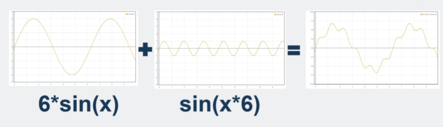

> 摘要： 目前游戏的背景图和登录的背景图比较小，本身只是一个图片组成的图层，mmoact游戏需要多个玩家可以不断的探索游戏的边界进行冒险，所以有限的地图基本无法在开放世界中留住玩家，手动不断生成地图工作量又大又没有连贯性，此时游戏开发界常用的算法之一就是柏林噪声算法了。

##

算法2个入参如果是连续的，那么出参也是连续的。根据这个特性，可以传入x和y,结果传进去然后再cocos里面渲染出灰度图来

灰度图直接用来渲染地形有点丑，可以采用叠加的形式。

## sinx
在这里需要平滑的叠加图像，以高中数学学过的函数sinx作为例子
正弦（sine），数学术语，是三角函数的一种，在直角三角形中，任意一锐角∠A的对边与斜边的比，叫作∠A的正弦，记作sinA（由英语sine一词简写得来），即sinA=∠A的对边/斜边。

影响sinx的曲线的因素有2个，
振幅决定纵向偏移幅度，频率决定横向波形次数
因此，可以组合2个正弦函数来组成更好的波形图

## 1*sin(1*x)

以sinx为例，每次给振幅除以2，给频率乘以2,得到类似的压缩图像，然后再把这四组图像叠加就可以得到一个趋近于山体的图像
然后再给灰度图每个区域上色，就可以得到类似的图片

