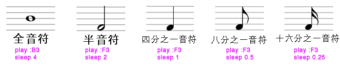
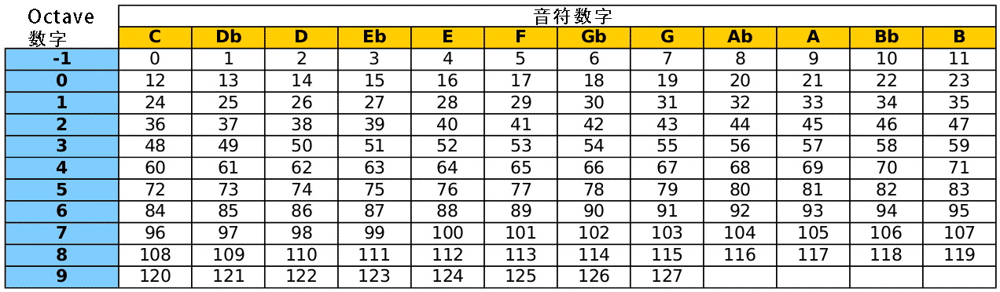

### 演奏一段旋律

输入以下内容并点击运行

```
play 60
play 67
play 69
```

### 休止符

听起来不成调，是吧？输入进Sonic Pi的所有音符都是即刻运行的（这也是和弦的创作基础），并不是有序演奏。 如果你想让Sonic Pi有序演奏，就要让软件适时停顿。在每个音符下面输入一行 sleep 1 ，如下图所示：
```
play 60
sleep 1
play 67
sleep 1
play 69
sleep 1
```
sleep 1指令代表休止一拍。你可以自行改成其他数值，数值越低，音符间休止时长越短，反之亦然。以下是五线谱和Sonic Pi指令对照表：



如前所述，MIDI可以用0到127(67, 80, 22) 的自然数或者音符 (:G4, :Ab5, :Bb)来编曲。 下图是一个MIDI数值和音符的对照表。



### 谱写一段旋律
用C大调音阶(72, 74, 76, 77, 79, 81, 83 要么 :C5 :D5 :E5 :F5 :G5 :A5 :B5) 来谱写一段旋律。用 sleep 指令配合不同数值来区别韵律。

- 在代码开端使用 use_bpm 指令可以界定节奏快慢。

- BPM是每分钟节拍(Beats Per Minute)的缩写。
```
use_bpm 120

play 72
sleep 0.25
play 76
sleep 0.25
play 76
sleep 0.25
play 72
sleep 0.5
play 83
sleep 0.25
play 74
sleep 0.25
play 83
sleep 0.25
play 79
play 84
```
开始你的个人创作吧！
