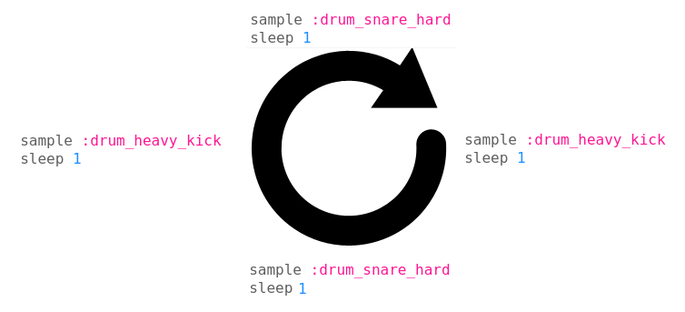

### 鼓点

我们来看一下如何编写一段包含大鼓，小鼓和踩镲的鼓点。你能学会两点：live_loop指令和采样。

在空白的编程面板创建一个名为:drums的live_loop指令。你可以随意命名，名字只是为了快速辨别循环了什么内容。live_loop是一个可以跟其他多个live_loop同步的无限循环（一个live_loop至少要有一个sleep指令）：
```
live_loop :drums do
  sample :drum_heavy_kick
  sleep 1
end
```

点击run来听听你的第一个live_loop演奏的每一个漂亮的节拍。

我们在1、3行用大鼓，2、4行用小鼓做一个简单的基调强节奏。不同于演奏音符，你会触发采样。就像输入sample :sample_name一样简单。下面是鼓点的举例。

```
use_bpm 100

live_loop :drums do
  sample :drum_heavy_kick
  sleep 1
  sample :drum_snare_hard
  sleep 1
  sample :drum_heavy_kick
  sleep 1
  sample :drum_snare_hard
  sleep 1
end
```

这就是个稳定的基调强节奏。鼓点循环从大鼓开始，小鼓在第二拍，第三拍还是大鼓，第四拍小鼓。然后循环又开始了：



现在试着变一下节奏（use_bpm后的数字）然后用采样演奏一下。在输入采样名称的时候，浏览一下各种自动完成的采样的特性。试试不同的采样然后感受一下他们听起来都什么样。需要留意的是，你想变换声音的时候并不需要点击终止按钮，改写代码再重新点击运行，声音就会在下一个循环自动变换而不会错过任何一个节拍！

### 加入踩镲
现在加一个踩镲。创建一个名为hihat的live_loop然后加入你的hi-hat采样。 你可以直接做这样的八分之一或者十六分之一的音符（这个就是十六分之一）

```
live_loop :hihat do
  sample :drum_cymbal_closed
  sleep 0.25
end
```

但是不用这么死板，也可以做得像这样放一点：
```
live_loop :hihat do
  sample :drum_cymbal_closed
  sleep 0.25
  sample :drum_cymbal_pedal
  sleep 1
end
```
多重节奏模式最开始是一个“错误”。这个循环时长1.25拍 而不是一拍。但是听起来很带感！所以记得多犯点错，也就能发现点没想刻意发现的结果。

现在歌曲就听起来像这样了
```
use_bpm 100

live_loop :drums do
  sample :drum_heavy_kick
  sleep 1
  sample :drum_snare_hard
  sleep 1
  sample :drum_heavy_kick
  sleep 1
  sample :drum_snare_hard
  sleep 1
end

live_loop :hihat do
  sample :drum_cymbal_closed
  sleep 0.25
  sample :drum_cymbal_pedal
  sleep 1
end
```
